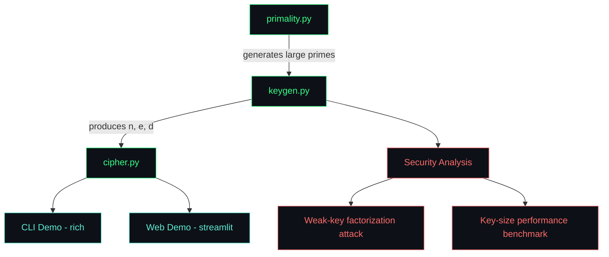
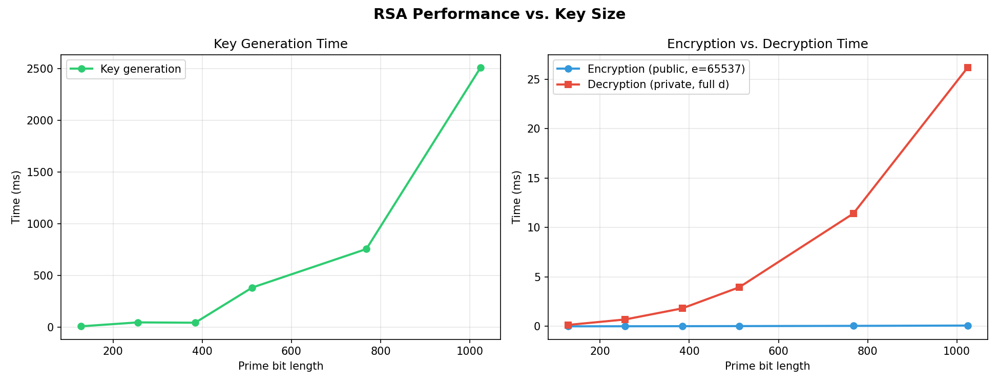

# 🔐 RSA Cryptosystem

[crypto.webm](https://github.com/user-attachments/assets/e4048b84-76f7-41e9-a392-9aa214ce9e33)


A from-scratch implementation of the RSA public-key cryptosystem in Python — covering key generation, encryption/decryption, a security analysis of why RSA's parameters matter, and both CLI and browser-based interactive demos.

**[Live Demo](https://rsacryptosystem-moynul-rifat.streamlit.app/)** . **[Security Analysis](#security-analysis)**

---

## Why this project exists

RSA is one of the foundational algorithms of modern cryptography — it underpins TLS/HTTPS, SSH, and digital signatures across the internet. This project implements it without relying on any cryptography library (no `pycryptodome`, no `cryptography` package): every primality test, every modular exponentiation, and every key derivation step is built from first principles using only Python's standard library.

The goal isn't just to make RSA "work" — it's to demonstrate *why* it works, and just as importantly, *how it fails* when implemented carelessly. The `security_analysis/` module includes a working attack that breaks a deliberately weak key in a fraction of a millisecond, which is the kind of practical security insight that distinguishes an implementation from an understanding.

## Architecture



```
rsa-cryptosystem/
├── rsa_crypto/              # Core engine
│   ├── primality.py         # Miller-Rabin primality test, prime generation
│   ├── keygen.py             # Key pair generation (Extended Euclidean Algorithm)
│   └── cipher.py             # Encryption / decryption (UTF-8 message support)
├── tests/                    # 63 unit tests (pytest)
├── demo/                     # Animated terminal demo (rich)
├── web_demo/                 # Browser demo (streamlit)
├── security_analysis/        # Weak-key attack + performance benchmark
└── requirements.txt
```

## The math, briefly

RSA's security rests on a simple asymmetry: multiplying two large primes is fast, but factoring their product back into the original primes is believed to be computationally infeasible at sufficient key sizes.

**Key generation:**
1. Generate two large random primes, `p` and `q`
2. Compute the modulus `n = p × q`
3. Compute Euler's totient `φ(n) = (p−1)(q−1)`
4. Choose public exponent `e` such that `gcd(e, φ(n)) = 1` (this project uses the industry-standard `e = 65537`)
5. Derive private exponent `d` as the modular inverse of `e` mod `φ(n)`, via the Extended Euclidean Algorithm

**Encryption / decryption:**
- Encrypt: `ciphertext = message^e mod n` (using only the public key)
- Decrypt: `message = ciphertext^d mod n` (using only the private key)

The correctness of this round-trip follows from Euler's theorem, and its security follows from the (conjectured) hardness of the RSA problem — recovering `message` from `ciphertext` and `(n, e)` alone, without factoring `n`.

### A note on textbook RSA

This implementation uses textbook RSA (no padding scheme), which is deterministic: the same plaintext block always produces the same ciphertext under a given key. Real-world systems always use a padding scheme such as OAEP to randomize ciphertexts and prevent several known attacks. This limitation is intentional here, kept for mathematical transparency, and is explicitly why `security_analysis/` exists — to make the *consequences* of implementation choices visible rather than just asserted.

## Getting started

```bash
git clone https://github.com/E-Moynul/RSA_CryptoSystem.git
cd RSA_CryptoSystem
pip install -r requirements.txt
```

### Run the test suite

```bash
pytest tests/ -v
```

63 tests covering primality testing (including Carmichael numbers, which fool weaker tests), key generation correctness, and encryption/decryption round-trips across English, Bangla, and emoji text.

### Run the CLI demo

```bash
python3 -m demo.demo
```

<a name="cli-demo"></a>


### Run the web demo locally

```bash
streamlit run web_demo/app.py
```

Or use the **[live hosted version](https://rsacryptosystem-moynul-rifat.streamlit.app/)**.

<a name="security-analysis"></a>
### Run the security analysis

```bash
python3 -m security_analysis.weak_key_attack
python3 -m security_analysis.benchmark
```

## Security analysis: why parameters matter

### Weak-key factorization attack

A key generated with `p` and `q` chosen too close together can be factored almost instantly using **Fermat's Factorization Method**, regardless of how many bits the modulus has:

```
Weak key  (|p - q| = 38):       factored in 0 iterations, 0.0001s
Proper key (|p - q| ≈ 2^256):   NOT factored after 2,000,000 iterations (2.22s)
```

This demonstrates that key *size* alone doesn't guarantee security — the primes must also be generated independently and randomly. This kind of correlated-prime vulnerability has occurred in real systems with flawed random number generation.

### Performance scaling



Key generation time grows steeply with prime size (driven by the cost of finding large primes), while encryption (using the small, fixed exponent `e = 65537`) stays nearly flat — decryption, which uses the full-size private exponent `d`, scales much more noticeably. This is the standard RSA asymmetry: encryption is cheap, decryption is expensive, by design.

## Tech stack

- **Python 3** standard library only for the core cryptographic engine (no external crypto dependencies)
- [`rich`](https://github.com/Textualize/rich) for the animated terminal demo
- [`streamlit`](https://streamlit.io/) for the browser demo
- [`matplotlib`](https://matplotlib.org/) for performance visualization
- [`pytest`](https://pytest.org/) for the test suite

## Author

Moynul Rifat

## License

MIT — see [LICENSE](LICENSE).
